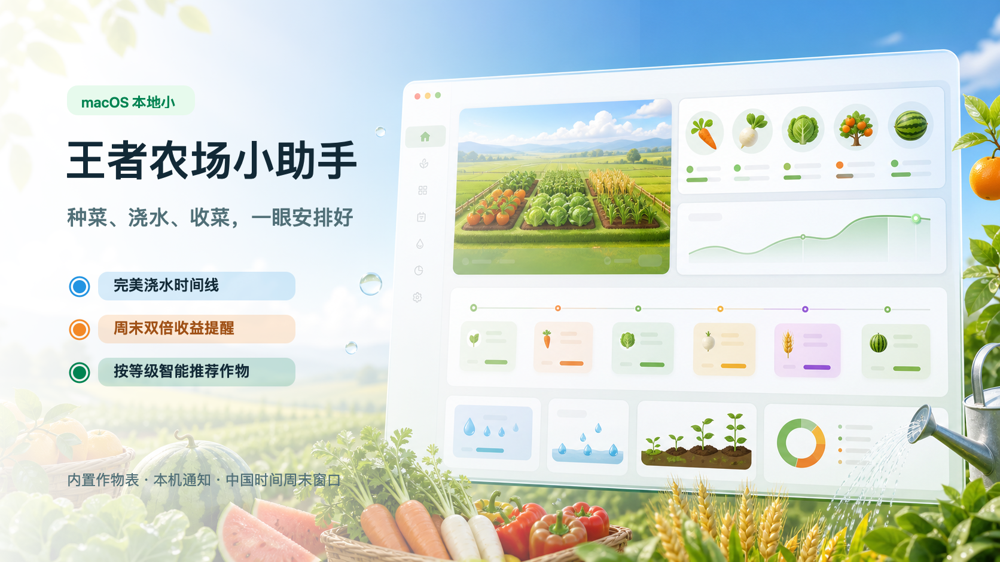

# 王者农场小助手



这是一个用 Swift 写的 macOS 本地小工具，用来估算王者荣耀农场类活动的种菜、浇水和收菜时间。

## 功能

- 选择种植时间和作物档位
- 查看自然成熟时间和完美浇水成熟时间
- 查看 4 个浇水提醒节点和收菜时间
- 判断成熟时间是否落在周五 18:00 到周日 24:00 的双倍窗口
- 安排 macOS 本机通知提醒
- 显示本地作物图片资源

## 数据来源与假设

根据网上玩家攻略整理，常见作物分为 1 小时、8 小时、16 小时、32 小时档位。作物名、价格、成熟档位主要参考：

- https://www.youxiabc.com/p/31979.html
- https://www.youxiabc.com/p/28375.html
- https://www.18183.com/gonglue/202605/hkvbkhgv.html

完美浇水后的经验成熟时间约为：

- 1 小时菜：44 分钟
- 8 小时菜：5 小时 52 分钟
- 16 小时菜：11 小时 44 分钟
- 32 小时菜：23 小时 28 分钟

活动规则可能变化，请以游戏内显示为准。浇水节点采用均匀提醒法，因为公开攻略通常只给出浇满水后的总成熟时间，没有稳定的官方逐次浇水冷却表。

## 图片资源

`Sources/WangZheFarmAssistantApp/Resources/CropImages` 中的图片是本地生成的 PNG 占位素材，不是王者荣耀官方活动原图。由于没有找到稳定公开的官网作物图地址，当前版本用 macOS 彩色 emoji 渲染成作物图，方便离线展示。后续如果拿到官方素材，只要替换同名 PNG 文件即可。

## 编译

```bash
zsh scripts/build_app.sh
```

说明：项目保留了 `Package.swift`，方便用 Xcode / Swift Package Manager 打开源码；打包脚本为了兼容只安装 Command Line Tools 的 Mac，会直接用 `swiftc` 编译。

生成的 App 在项目目录：

```text
王者农场小助手.app
```
